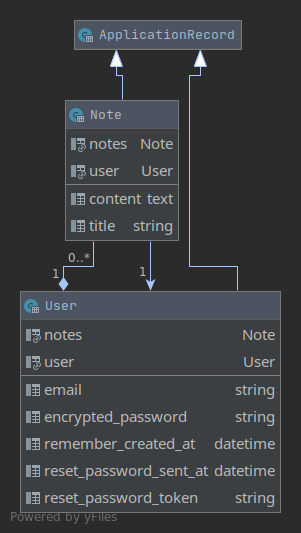

# Connections Portal

Main branch:
[](https://www.codefactor.io/repository/github/hpi-swt2/connections-portal/overview/main)
[](https://github.com/hpi-swt2/connections-portal/actions?query=workflow%3ACI%2FCD+branch%3Amain),
deployed version: [Heroku link](https://connections-portal-main.herokuapp.com/)

Dev branch: [](https://www.codefactor.io/repository/github/hpi-swt2/connections-portal/overview/dev) 
[](https://github.com/hpi-swt2/connections-portal/actions?query=workflow%3ACI%2FCD+branch%3Adev),
deployed version: [Heroku link](https://connections-portal-dev.herokuapp.com/)

[](https://opensource.org/licenses/MIT)

A web application for organizing and arranging networks, relationships and human connections, written in [Ruby on Rails](https://rubyonrails.org/).
Created in the [Software Engineering II course](https://hpi.de/plattner/teaching/winter-term-2020-21/softwaretechnik-ii-agile-software-development-in-large-teams.html) at the HPI in Potsdam.


## Development Setup

### Vagrant
* To [create the VM](https://www.vagrantup.com/docs/cli/up), run `vagrant up` (based on the `Vagrantfile`).
* Enter the machine using `vagrant ssh`.
* Go to the project directory `cd hpi-swt2`.
* Start the dev server `rails s -b 0.0.0.0` (`-b ` / `--binding=IP` allows connections from outside the VM).
* Go to `http://localhost:3000` in your browser to view the page.

### Local setup
* `ruby --version` Ensure Ruby v2.7.2 using [rbenv](https://github.com/rbenv/rbenv) or [RVM](http://rvm.io/)
* `sqlite3 --version` Ensure [SQLite3 database installation](https://guides.rubyonrails.org/getting_started.html#installing-sqlite3)
* `node --version; yarn -v` Ensure [Node.js and Yarn installation](https://guides.rubyonrails.org/getting_started.html#installing-node-js-and-yarn)
* `bundle -v` Ensure [Bundler](https://rubygems.org/gems/bundler) installation (with `gem install bundler`)
* `bundle config set without 'production' && bundle install` Install gem dependencies from `Gemfile`
* `yarn install --check-files` Install JS dependencies from `package.json`
* `rails db:migrate` Setup the database, run migrations
* `rails db:seed` Initialize database with default values (e.g. global chat)
* `rake devise:create_demo_user` Create a demo user (note _email & password_)
* `rails s` Start the Rails development server (default: _localhost:3000_) and log in using the demo credentials
* `bundle exec rspec` Run the tests (using the [RSpec](http://rspec.info/) test framework)

## Developer Guide

### Cheat Sheets
* [FactoryBot](https://devhints.io/factory_bot)
* [Testing using Capybara](https://devhints.io/capybara)

### Setup
* `bundle exec rails db:migrate RAILS_ENV=development && bundle exec rails db:migrate RAILS_ENV=test` Migrate both test and development databases
* `bundle exec rails assets:clobber && bundle exec rails assets:precompile` Redo asset generation

### Testing
* `bundle exec rspec` Run the full test suite
  * `-f doc` More detailed test output
  * `-e 'search keyword in test name'` Specify what tests to run dynamically
  * `--exclude-pattern "spec/features/**/*.rb"` Exclude feature tests (which are typically fairly slow)
* `bundle exec rspec spec/<rest_of_file_path>.rb` Specify a folder or test file to run
* `bundle exec rspec --profile` Examine run time of tests

### Linting
* `rake factory_bot:lint` Create each factory and catch any exceptions raised during the creation process (defined in `lib/tasks/factory_bot.rake`)
* `bundle exec rubocop` Use the static code analyzer [RuboCop](https://github.com/rubocop-hq) to find possible issues (based on the community [Ruby style guide](https://github.com/rubocop-hq/ruby-style-guide)).
  * `--auto-correct` to fix what can be fixed automatically.
  * RuboCop's behavior can be [controlled](https://docs.rubocop.org/en/latest/configuration) using `.rubocop.yml`

### Debugging
* `save_and_open_page` within a test to inspect the state of a webpage in a browser
* `rails c --sandbox` Test out some code in the Rails console without changing any data
* `rails dbconsole` Starts the CLI of the database you're using
* `bundle exec rails routes` Show all the routes (and their names) of the application
* `bundle exec rails about` Show stats on current Rails installation, including version numbers

### Generating
* `rails g migration DoSomething` Create migration _db/migrate/*_DoSomething.rb_
* `rails generate` takes a `--pretend` / `-p` option that shows what will be generated without changing anything

## Generating a Model Class Diagram with RubyMine

RubyMine, an IntelliJ-IDE designed for ruby projects supports generating an uml class diagram from the database scheme. An Instruction can be found here: [https://www.jetbrains.com/help/ruby/creating-diagrams.html#creating-explain-query-plan](https://www.jetbrains.com/help/ruby/creating-diagrams.html#creating-explain-query-plan).
Currently, a file named ```class-diagram.png``` in the projects root folder is linked in this README. So by overwriting this file, or adding a new one to the README, the current model dependencies can be updated.

## Current Model Class Diagram


